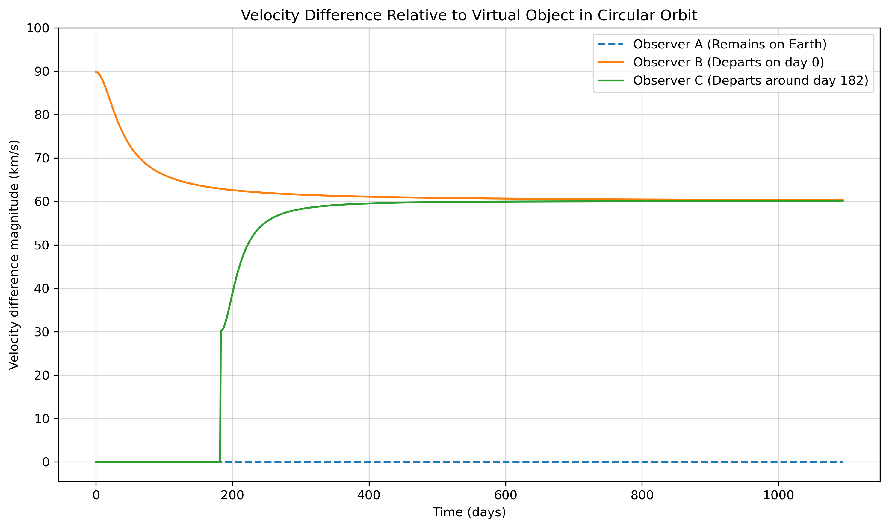

# Triplet experiment Simulation

This project simulates the kinematics and resulting relativistic effects of three observers (A, B, and C) traveling through the solar system. By comparing their speeds and trajectories to theoretical "virtual objects" in perfect, counter-clockwise circular orbits, this simulation models the kinematic time dilation each observer experiences.

## The Local Inertial Frame (LIF)
In this model, the "virtual objects" act as proxies for the local inertial frame in free fall at any given distance from the Sun. This concept is directly analogous to how the Earth-Centered Inertial (ECI) frame is used in real-world physics; for instance, the kinematic time dilation of GPS atomic clocks is calculated based on their velocity relative to the ECI.

## Kinematic Time Dilation Profiles
Because time dilation is dependent on the observer's velocity relative to their local inertial frame, the three observers experience significantly different relativistic effects throughout their journeys:
* **Observer A (Earth Baseline):** Remains in a perfect circular orbit, matching the velocity of the local virtual object. Consequently, Observer A experiences no relative kinematic time dilation and serves as our baseline clock.
* **Observer B:** Departs at $t=0$ with a trajectory that creates a high initial velocity relative to the local frame (equivalent to 90 km/s). This results in a high initial rate of time dilation. As Observer B travels further from the Sun, this time dilation gradually decreases, asymptotically settling at a rate corresponding to their constant 60 km/s travel speed..
* **Observer C:** Departs half a year later from the opposite side of the Sun. Due to Earth's orbital direction at that specific time, Observer C's initial velocity relative to the local frame is much lower (equivalent to 30 km/s), resulting in significantly less initial time dilation. Like B, C's time dilation also gradually evolves toward the 60 km/s baseline as they move out of the inner solar system.
* **The Convergence** After approximately 1,000 days, observers B and C reach identical velocity vectors relative to the local rest frame, maintaining a fixed distance from one another and experiencing the exact same rate of time dilation.

## The Physics & Simulation Parameters

The simulation is set up with the following parameters:
* **The Sun** is stationary at the origin `(x=0, y=0)`.
* **Observer A (Earth)** starts at `x=0, y=1 AU` and travels in a counter-clockwise circular orbit.
* **Observer B** departs Earth at `t=0` and travels in a straight line along the x-axis at a constant speed of 60 km/s.
* **Observer C** remains on Earth for half a year (until Earth reaches `x=0, y=-1 AU`), then departs in a straight line along the x-axis at a constant speed of 60 km/s.

### The Virtual Object Calculation
For any point `(x, y)` in space, an object is at a distance `r = √(x² + y²)` from the Sun. The orbital velocity for a perfect circular orbit at that distance is calculated as:

$$v_{circ} = \sqrt{\frac{GM_{Sun}}{r}}$$

Because the orbit is counter-clockwise, the direction of the velocity vector is tangent to the circle. The normalized tangent vector for a point `(x, y)` is `(-y/r, x/r)`. The velocity vector of the virtual object is therefore:

$$\vec{v}_{virtual} = v_{circ} \cdot \left(-\frac{y}{r}, \frac{x}{r}\right)$$

At every daily time step, the script calculates the vector difference in velocity between each observer and this theoretical virtual object.

## Activate the environment

* conda env create -f environment.yml
* conda activate triplet-experiment

## Run the simulation

python main.py

This will create the file: 
* velocity_difference_plot.png

